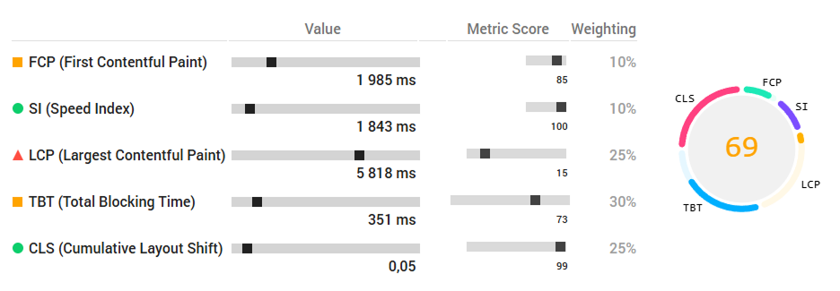
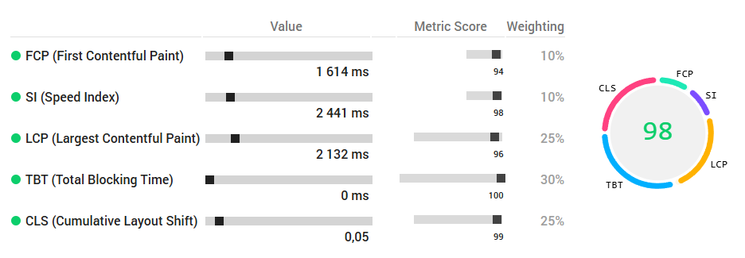

## 📊 Lighthouse Metrics — Before → After Optimization

### 🔥 Summary
| Metric | Before | After | Improvement |
|--------|--------|--------|--------------|
| **Performance** |  |  | ↑ +29 |
| **Accessibility** |  |  | ↑ +1 |
| **Best Practices** |  |  | ↑ +29 |
| **SEO** |  |  | — |

---

### 🖼 Before / After 

|  |  |
|:--:|:--:|
| **Before** | **After** |

---

### 🎯 JSON reports
- [📄 Before JSON](./media/json/before.json)
- [📄 After JSON](./media/json/after.json)

---

### 🔍 Key Improvements
- Implemented `<picture>` with responsive WebP sources
- Preloaded LCP image
- Removed blocking JS, added `defer`
- Reduced main-thread work by refactoring components
- Optimized CSS bundle (−49 KB unused CSS)
- Enhanced modal accessibility (`aria-modal`, `aria-controls`)
